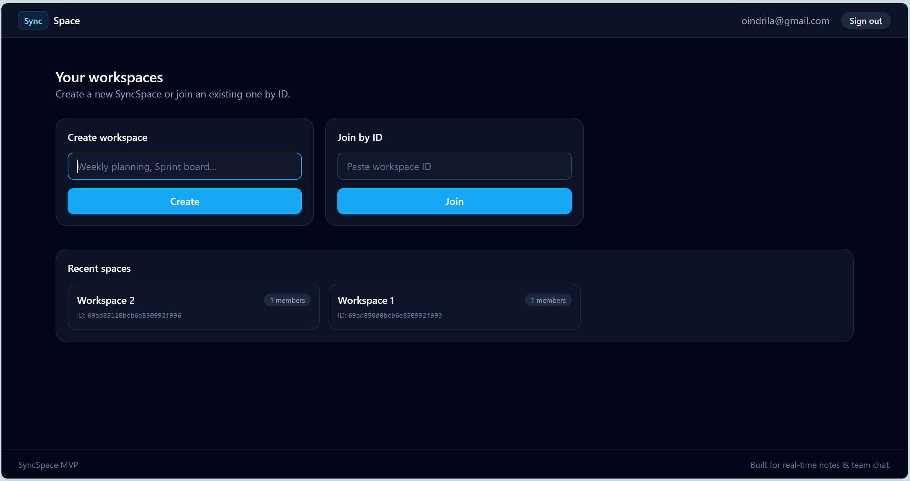
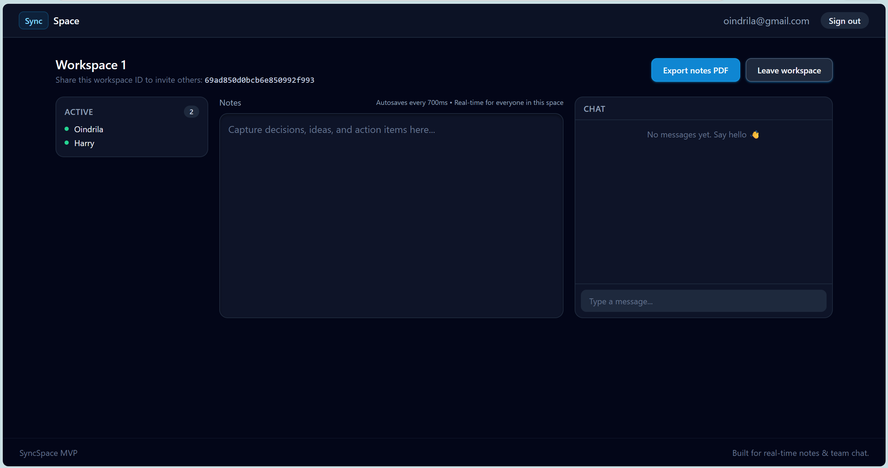

## SyncSpace

A real-time collaborative workspace platform where users can create shared workspaces, edit notes together, chat instantly, and see active collaborators.

### Screenshots

#### Dashboard :


#### Workspace :


### Stack

- **Frontend**: React (Vite, TypeScript), React Router, Axios, Socket.io client, TailwindCSS.
- **Backend**: Node.js, Express, Socket.io, MongoDB (Mongoose), JWT auth with bcrypt.

### Features

- **Authentication**
  - Register and login with email/password.
  - JWT-based auth, stored in `localStorage` and attached via Axios interceptor.
  - Protected routes on the frontend; backend guards with `authMiddleware`.

- **Workspaces**
  - Create workspaces with a title.
  - Join workspaces by ID.
  - Each workspace tracks `title`, `createdBy`, `members`, and shared `noteContent`.
  - Dashboard shows recent spaces and member counts.

- **Real-time notes**
  - Simple textarea, shared by all members in a workspace.
  - Socket.io rooms per `workspaceId` for live `noteChange` events.
  - Debounced persistence to MongoDB (~700ms) to avoid excessive writes.

- **Real-time chat**
  - Right-hand chat panel per workspace.
  - Messages stored in MongoDB with sender and timestamps.
  - Real-time delivery over Socket.io plus initial history over REST.

- **Active users**
  - Left-hand sidebar shows currently connected users per workspace.
  - Uses Socket.io presence tracking.
  - Lightweight toast notifications when other users join or leave.

- **Export to PDF**
  - One-click export of workspace notes to PDF via a backend endpoint.
  - Includes workspace title and timestamp.

### Architecture

```text
Client (React + Socket.io)
        |
 REST API / WebSocket
        |
  Node.js + Express
        |
   MongoDB (Mongoose)
```

### Project structure

```text
syncspace/
├── backend
│   ├── src
│   │   ├── controllers
│   │   ├── models
│   │   ├── routes
│   │   ├── middleware
│   │   ├── socket
│   │   └── utils
│   └── package.json
│
├── frontend
│   ├── src
│   │   ├── pages
│   │   ├── components
│   │   ├── context
│   │   ├── services
│   │   ├── hooks
│   │   ├── layouts
│   │   └── types
│   └── package.json
│
└── README.md
```

### Environment variables

SyncSpace uses environment variables for backend configuration.

- Copy the example file to create your local config:

  ```bash
  cp .env.example backend/.env
  ```

- Then fill in:
  - **`MONGODB_URI`**: connection string for your MongoDB database.
  - **`JWT_SECRET`**: secret key used to sign authentication tokens.
  - **`CLIENT_ORIGIN`**: URL of the frontend (default `http://localhost:5173`).

After updating environment variables, restart the backend server.

### Running locally

- **Backend**

  ```bash
  cd backend
  npm install
  npm run dev
  ```

- **Frontend**

  ```bash
  cd frontend
  npm install
  npm run dev
  ```

Open the frontend URL (default `http://localhost:5173`) in your browser, register a user, create a workspace, and start collaborating in real time.

### Future improvements

- Rich text editor for notes.
- Cursor presence indicators (like Google Docs).
- Role-based workspace permissions (owner, editor, viewer).
- File attachments and shared assets per workspace.
- Deployment with Docker and CI/CD pipeline.

